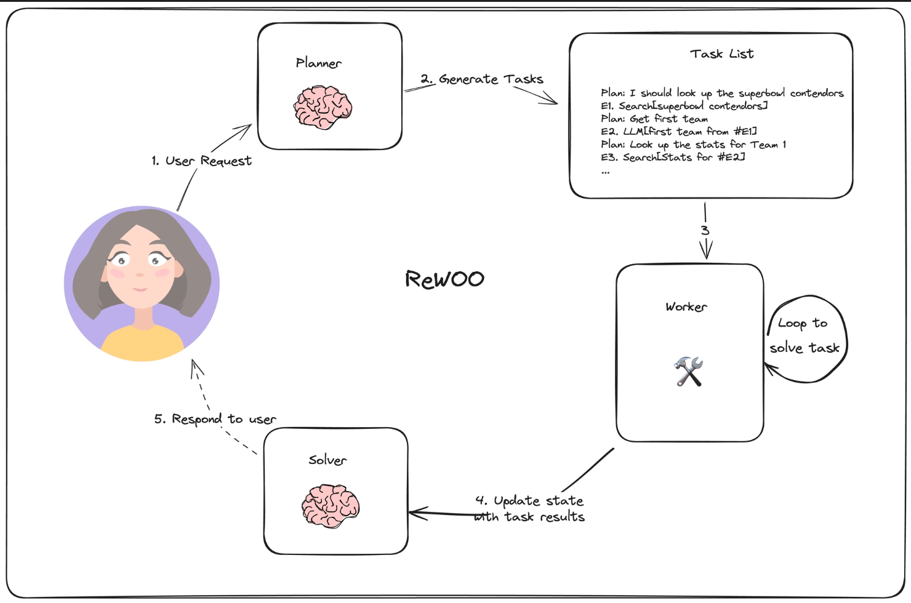
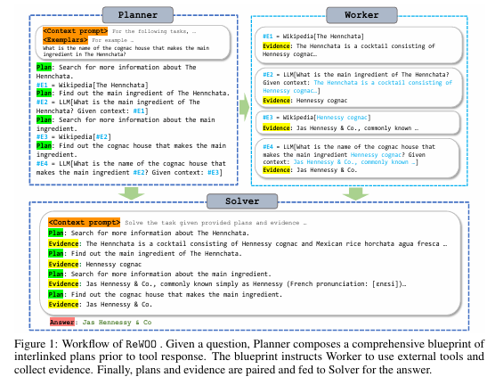
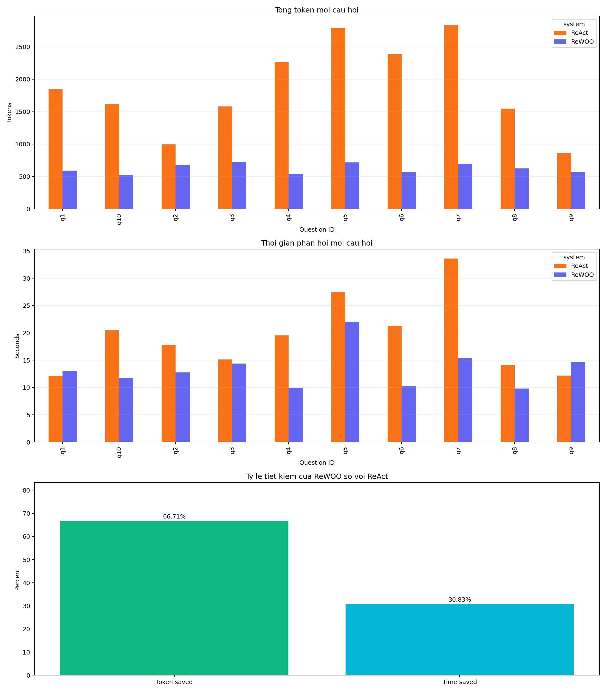

# ReWOO Agent Demo

Demo này triển khai một agent theo kiến trúc ReWOO (Reasoning Without Observation) bằng LangGraph, kèm giao diện Streamlit để người dùng phê duyệt kế hoạch trước khi thực thi, notebook giải thích luồng hoạt động, và benchmark so sánh trực tiếp với ReAct tiêu chuẩn.

## Mục tiêu

Project nhằm trả lời câu hỏi: liệu ReWOO có thực sự tiết kiệm tài nguyên hơn ReAct hay không.

Ý tưởng cốt lõi của ReWOO trong notebook là:

- Giảm tiêu thụ token và thời gian thực thi bằng cách lập trước toàn bộ chuỗi tool cần dùng
- Đơn giản hoá dữ liệu huấn luyện hoặc fine-tuning vì phần planning không phụ thuộc trực tiếp vào observation ở từng bước

Trong repo này có 3 phần chính:

- Một ứng dụng Streamlit để chạy agent ReWOO có Human-in-the-Loop
- Một notebook minh hoạ cách xây dựng planner, worker, solver và graph
- Một benchmark ReAct vs ReWOO trên 10 câu hỏi nhiều bước, có đo token và thời gian phản hồi

## Kiến trúc ReWOO trong project

ReWOO trong project này được chia thành 3 mô-đun:

1. Planner
   Tạo kế hoạch nhiều bước theo dạng:

   ```text
   Plan: <reasoning>
   #E1 = Tool[input]
   Plan: <reasoning>
   #E2 = Tool[input có thể dùng #E1]
   ```

2. Worker
   Thực thi từng bước tool theo thứ tự, thay thế các biến trung gian như `#E1`, `#E2` bằng kết quả thật.

3. Solver
   Tổng hợp toàn bộ bằng chứng và sinh ra câu trả lời cuối cùng.

Điểm khác với ReAct là planner của ReWOO tạo trước toàn bộ kế hoạch, nên không cần lặp lại chuỗi prompt dài ở mỗi vòng suy luận như ReAct.



### Định dạng plan

Planner trong notebook dùng định dạng có thể thay thế biến trung gian:

```text
Plan: <reasoning>
#E1 = Tool[argument for tool]
Plan: <reasoning>
#E2 = Tool[argument for tool with #E1 substitution]
```

Nhờ đó worker có thể thực thi tuần tự mà không cần gọi lại planner sau mỗi observation.

## Cấu trúc repo

```text
rewoo/
├─ app.py
├─ main.ipynb
├─ benchmark_compare.py
├─ benchmark_questions.json
├─ benchmark_outputs/
│  ├─ benchmark_results.csv
│  ├─ benchmark_summary.json
│  └─ benchmark_comparison.png
├─ diagram.png
├─ workflow.png
├─ .env.example
└─ README.md
```

## Yêu cầu môi trường

- Python 3.10+
- OpenRouter API key
- Tavily API key

## Cài đặt

### 1. Cài dependency

```bash
pip install -r requirements.txt
```

### 2. Tạo file môi trường

Tạo file `.env` từ `.env.example`:

```env
OPENROUTER_API_KEY=your_openrouter_key
TAVILY_API_KEY=your_tavily_key
```

## Chạy ứng dụng Streamlit

```bash
streamlit run app.py
```

Luồng hoạt động của app:

1. Nhập câu hỏi hoặc nhiệm vụ
2. Agent sinh kế hoạch nhiều bước
3. Người dùng xem, sửa hoặc phê duyệt kế hoạch
4. Graph chạy toàn bộ tool steps
5. Solver tổng hợp evidence và trả kết quả cuối cùng

### Các điểm đã có trong app

- Human-in-the-Loop: dừng sau bước plan để người dùng phê duyệt
- Giao diện Streamlit đã được tuỳ biến để dễ demo
- Xử lý lỗi API thân thiện hơn, đặc biệt với lỗi OpenRouter 401
- State được lưu qua `MemorySaver` để không mất checkpoint sau mỗi lần Streamlit rerun

## Notebook giải thích

File [main.ipynb](main.ipynb) là notebook minh hoạ cách xây ReWOO từng bước:

- Định nghĩa state
- Tạo planner prompt
- Parse kế hoạch thành các step
- Thực thi tool tuần tự
- Tổng hợp bằng solver
- Nối tất cả thành graph bằng LangGraph

Notebook cũng giải thích rõ 3 vai trò chính:

- Planner: sinh plan với các biến `#E1`, `#E2`
- Worker: thực thi tool và thay thế biến bằng kết quả thật
- Solver: đọc toàn bộ evidence để trả lời nhiệm vụ cuối cùng



## Benchmark ReAct vs ReWOO

File [benchmark_compare.py](benchmark_compare.py) dùng để so sánh ReAct và ReWOO trên cùng một bộ câu hỏi.

### Bộ dữ liệu benchmark

File [benchmark_questions.json](benchmark_questions.json) chứa 10 câu hỏi dạng tra cứu + suy luận nhiều bước. Mỗi câu thường cần khoảng 3 đến 5 bước để hoàn thành.

### Output benchmark

Sau khi chạy, script sẽ sinh:

- [benchmark_results.csv](benchmark_outputs/benchmark_results.csv): kết quả từng câu hỏi
- [benchmark_summary.json](benchmark_outputs/benchmark_summary.json): tổng hợp theo hệ
- [benchmark_comparison.png](benchmark_outputs/benchmark_comparison.png): biểu đồ so sánh

Biểu đồ benchmark hiện tại:



## Kết quả benchmark hiện tại

Benchmark 10 câu đã được chạy thành công với cấu hình:

- Model: `deepseek/deepseek-chat`
- `BENCHMARK_MAX_TOKENS=128`

### Tổng quan

| Hệ thống | Tổng thời gian | TB mỗi câu | Tổng token | TB mỗi câu | LLM calls | Success |
|---|---:|---:|---:|---:|---:|---:|
| ReAct | 193.725s | 19.372s | 18,718 | 1,871.8 | 45 | 10/10 |
| ReWOO | 133.993s | 13.399s | 6,231 | 623.1 | 21 | 10/10 |

### Mức tiết kiệm của ReWOO so với ReAct

- Giảm `12,487` token
- Tiết kiệm `66.71%` token
- Nhanh hơn `59.732` giây
- Giảm `30.83%` thời gian phản hồi

Kết luận thực nghiệm từ benchmark này:

- ReWOO giảm số lần gọi LLM đáng kể
- ReWOO giảm mạnh token do không phải lặp lại scratchpad dài như ReAct
- ReWOO cũng nhanh hơn rõ rệt trên cùng bộ câu hỏi và cùng model

## Hạn chế hiện tại

- Benchmark hiện tập trung vào chi phí token và thời gian, chưa chấm điểm chất lượng đáp án tự động
- Ứng dụng đang dùng prompt tiếng Việt, nên nếu đổi sang model khác cần kiểm tra lại độ ổn định của planner

## Hướng mở rộng

- Thêm đánh giá chất lượng câu trả lời bên cạnh token và latency
- Tăng bộ benchmark và chia theo nhóm câu hỏi
- Ghi log chi tiết từng bước để dễ demo hơn trong giao diện
